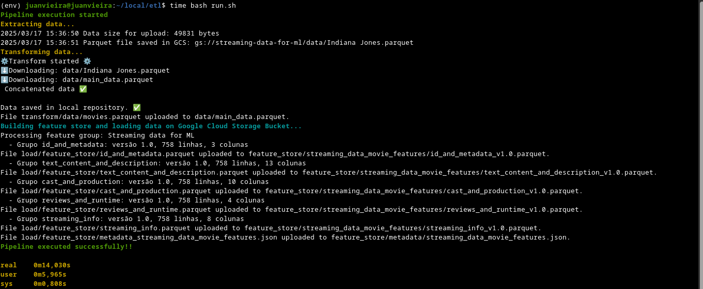

## ETL on Google Cloud Platform 

This data engineering project contains a complete ETL pipeline.

### Data Stack

**Go**
- xitongsys/parquet-go/
- spf13/viper
- go.uber.org/zap
- cloud.google.com/go/storage

**Python**
- Google Cloud API
- Pandas
- Fast Parquet

**Google Cloud Platform**
- Storage

### Extract

We extract data from a public API, with movie data, we use the Parquet format to reduce cloud costs and latency, (the data arrives in JSON and we convert it to parquet).

### Transform

The data is cleaned and more features are created using featuring engineering, considering different scenarios in which we can work with the data, such as classification, regression or NLP problems.

- Before: 14 features
- After: 38 features

### Load

In this step, we manage a feature store, where features are separated into groups, each group has its own metadata and there is simple data version control. All features are stored in the bucket, in Google Cloud Storage and the pipeline is finalized.

## Performance

We run the pipeline in a bash script. We can see that the pipeline runs in ~14 seconds.

Autor: Juan Vieira